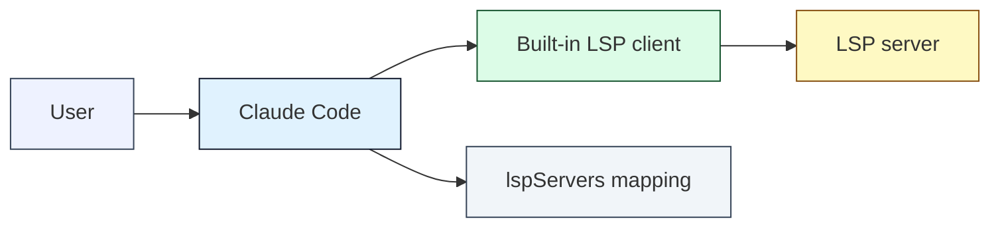
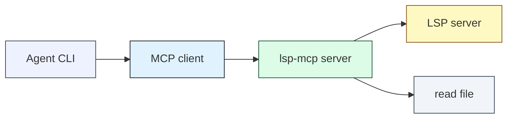
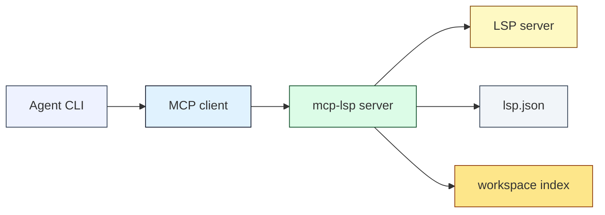
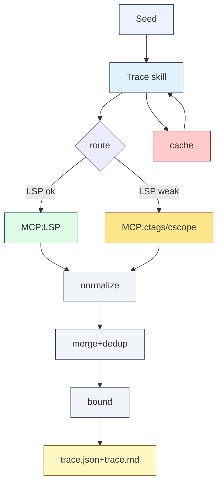

# LSP 在 Agent CLI 的三種整合路線與整合架構（zh-tw）

## 0. 問題定義（trace code 專用）
目標是讓 Agent CLI 在追 code path（定義→引用→呼叫關係→型別/繼承）時：
- 降低誤判率（避免純文字搜尋造成的同名、巨集、條件編譯、模板/typedef 轉換誤判）。
- 提升準確率（以語意與編譯旗標為準）。
- 加速分析（減少全 repo 掃描與整檔讀取、支援快取/索引）。
- 易於安裝與維護（設定資料化、可降級、可觀測）。

---

## 1) 三個參考做法（記錄、比較、優劣、可截取設計理念）

### A. Claude Code 官方 LSP plugin（設定包）
參考：`anthropics/claude-plugins-official`  
重點：不是 MCP server；是把 `lspServers`（`command/args/extensionToLanguage`）做成 marketplace 設定，交由 Claude Code 內建 LSP client 啟動/管理。

可取設計理念（可截取）
- 設定資料化：用「副檔名→languageId→server」映射，避免專案內硬編碼。
- 執行層集中：LSP client 生命週期、權限、隔離由宿主（Claude Code）統一管理。
- 最小可維運單元：plugin 只提供 mapping/安裝說明，降低外掛程式碼風險面。

主要優點
- 安裝/維護成本低（對使用者來說只要裝 LSP server）。
- 攻擊面小（不引入額外 bridge server）。

主要缺點（對 trace code 需求）
- 無法自定義「trace 專用工作流」（深度限制、合併去重、信心分數、降級策略等）。
- 可用 LSP query 的範圍受限於宿主支援；無法自由擴充新 tools。

---

### B. Tritlo/lsp-mcp（輕量 MCP bridge）
參考：`Tritlo/lsp-mcp`（`npx tritlo/lsp-mcp <language-id> <path-to-lsp> ...`）  
重點：提供 hover/completion/diagnostics/code actions 與 open/close doc、start/restart；偏「少數互動能力」。

可取設計理念（可截取）
- 以 MCP tools 封裝 LSP：用 MCP 把 LSP capability 暴露成 agent 可呼叫工具。
- session 生命週期顯性：要求先 `start_lsp` 再使用工具，避免 root dir 不正確。

主要優點
- 依賴少、入口簡單，適合快速打通「MCP ↔ LSP」。

主要缺點（對 trace code 需求）
- trace 核心缺口：未聚焦 `definition/references/callHierarchy/workspaceSymbol` 等導航能力（需自行擴充或加 adapter）。
- 結果多以文字/JSON 字串回傳，後續合併/去重/快取較難標準化。

---

### C. axivo/mcp-lsp（完整 MCP LSP server）
參考：`axivo/mcp-lsp`（`@axivo/mcp-lsp` + `LSP_FILE_PATH=/abs/path/to/lsp.json`）  
重點：提供完整 LSP 面向工具：definitions/references/implementations/typeDefinition、call hierarchy、type hierarchy、workspace/document symbols、格式化、code actions、資源管理與 rate limit。

可取設計理念（可截取）
- 工具面完整：將常用 LSP methods 直接映射成可呼叫 tools，適合 trace/graph。
- 設定檔驅動：以 `lsp.json` 宣告 servers + projects，利於多語言/多 repo。
- 內建工程化：rate limit、隔離、timeout、file preload、workspace 能力探測，利於可觀測與穩定性。

主要優點
- 直接滿足 trace code 所需的語意導航工具集合。
- 多 project/workspace 管理較完善，適合「Agent 長駐、多回合分析」。

主要缺點/風險
- Node 版本需求較高（README 指 Node >= 24）。
- 對於缺 compile flags 的 C/C++，仍會受 LSP（clangd）本身品質限制；需要降級方案（ctags/cscope）。

---

### 三者比較表（優劣分析）
| 面向 | Claude Code LSP plugin（設定包） | Tritlo/lsp-mcp（輕量 bridge） | axivo/mcp-lsp（完整 server） |
|---|---|---|---|
| 核心定位 | 宿主內建 LSP client 的設定映射 | MCP ↔ LSP 橋接（少量工具） | MCP ↔ LSP 全功能橋接（大量工具） |
| Trace 支援度 | 取決於宿主內建功能 | 低（需自行補齊） | 高（definitions/references/call hierarchy 等） |
| 可編排工作流 | 低（偏固定） | 中（可在上層 skill 編排） | 中（同上，且工具較齊） |
| 可擴充性 | 低（需改宿主） | 中（可擴 tool） | 中（可擴 tool；已很完整） |
| 安裝/維護 | 低 | 中 | 中（Node 版本/設定檔） |
| 結果可結構化 | 宿主決定 | 偏弱（常回文字） | 偏強（工具設計偏結構化） |
| 適用場景 | 寫碼/診斷/補全（宿主內） | 小型補強 | Trace/Review/導航（Agent CLI） |

---

## 2) 三種 LSP 在 Agent CLI 的應用方式：表格 + 圖

### 應用方式總覽表
| 路線 | Agent CLI 看到的介面 | LSP 啟動者 | 資料型態 | 典型用途 |
|---|---|---|---|---|
| Claude plugin | 宿主內建（非 MCP） | 宿主（Claude Code） | 宿主格式 | 互動寫碼、即時診斷、補全 |
| Tritlo/lsp-mcp | MCP tools（hover/completion/diagnostic） | MCP server | 文字/JSON 字串為主 | 快速拿 hover/diagnostic |
| axivo/mcp-lsp | MCP tools（導航/階層/符號） | MCP server | 結構化為主 | trace、call graph、type graph |

### 圖 A：Claude Code LSP plugin（設定包）

- 設計要點：設定資料化（mapping）+ 宿主管理 lifecycle。

### 圖 B：Tritlo/lsp-mcp（輕量 MCP bridge）

- 設計要點：用 MCP tools 封裝少量 LSP 功能；trace 導航能力需補齊。

### 圖 C：axivo/mcp-lsp（完整 MCP LSP server）

- 設計要點：工具面完整 + 設定檔驅動 + index/rate limit 等工程化。

---

## 3) 重新規劃整合架構（以三者為參考目標）

### 3.0 設計原則（對應 3.1~3.8）
- Trace 專用：只把「導航/關聯」做深（definition/references/call/type hierarchy），不把 refactor 當必需。
- 誤判最小化：語意結果優先；每筆結果附來源與信心分數；可重現（repo revision signature）。
- 分析加速：最小檔案讀取、cache、限制 fanout/depth、rate limit 與 timeout。
- 易維護：設定資料化、分層清楚、provider 可替換（LSP/ctags/cscope）。
- 介面標準化：所有 provider 回傳同一套 `Location/Symbol/Edge` schema，便於 merge/dedup。

---

### 3.1 分層架構（清楚、可維護）
| 層級 | 名稱 | 職責 | 可替換/可選 |
|---|---|---|---|
| L0 | Agent prompts / custom prompts | 固定輸入輸出風格、trace 任務模板 | 可用 |
| L1 | Trace Orchestrator（Skill / Agent） | 路由決策、深度/扇出控制、合併去重、快取策略 | 必需 |
| L2 | Semantic Provider（MCP:LSP） | LSP 查詢：definition/references/call/type hierarchy、symbols、hover、diagnostics | 必需（可選不同 server） |
| L3 | Index Provider（MCP:ctags/cscope） | 在 LSP 不可用/低信心時提供近似導航；補齊巨集/裸 C 專案 | 可選但建議 |
| L4 | Text Fallback（rg/ast-grep） | 最後手段；僅用於定位候選與輔助判讀 | 可選 |
| L5 | Cache/Telemetry | 快取、可觀測（耗時、命中率、節點數） | 必需（最小版即可） |

---

### 3.2 整合元件（推薦落地組合）
1. **LSP MCP（優先採 `axivo/mcp-lsp`）**
   - 用來提供 trace 必備 tools（definitions/references/call hierarchy/workspace symbols）。
   - 以設定檔驅動 servers/projects（借用 `lsp.json` 模式）。
2. **Index MCP（自建或既有）**
   - `ctags`：快速 symbol 定位（無 compile db 時可用）。
   - `cscope`：C 專案 callers/callees/refs（大型專案降級路徑）。
3. **Trace Skill（流程層）**
   - 輸入：seed（檔案+行列 / symbol 名 / 函式名 / callsite）。
   - 輸出：`trace.json`（graph）+ `trace.md`（報告）。
   - 決策：LSP 優先，低信心或空結果則啟用 ctags/cscope；必要時才 `rg/ast-grep`。

---

### 3.3 主要資料結構（統一 schema；便於合併與快取）
- `Location`
  - `path`（workspace 相對路徑）
  - `range`（start/end line/col，1-based）
  - `kind`（definition/reference/caller/callee/type/symbol）
  - `provider`（lsp|cscope|ctags|rg）
  - `confidence`（0~1）
- `Edge`
  - `from`（Location/Symbol）
  - `to`（Location/Symbol）
  - `relation`（calls/defines/refers/implements/extends/typedefs）
- `TraceGraph`
  - `nodes[]` + `edges[]` + `meta`（repo signature、工具版本、時間）

---

### 3.4 Trace 流程（降低誤判 + 加速）

- `route` 判斷：結果是否為空/候選過多、server 是否 ready、是否缺 compile db（針對 C/C++）。
- `bound`：限制 `maxDepth/maxNodes/maxFanout`，避免 call graph 爆炸。

---

## 4) 安裝與維護（zh-tw）

### 4.1 安裝策略（可維護、易部署）
1. 安裝各語言 LSP server（例：C/C++：`clangd`；Lua：`lua-language-server`）。
2. 安裝 LSP MCP server（建議 `@axivo/mcp-lsp`）。
3. 安裝 index 工具（可選）：`ctags`、`cscope`。
4. 部署 trace skill（Skill/Agent/custom prompt），只依賴「MCP tools + 本地檔案讀取」。

### 4.2 設定檔（借用 `mcp-lsp` 的 `lsp.json` 概念；統一管理）
建議路徑（示例）：`~/.config/agent-cli/lsp.json`（必須絕對路徑供 MCP 環境變數使用）
- `servers.<language-id>.command/args/extensions/projects[]`
- project path 使用絕對路徑；避免工作目錄歧義。

### 4.3 MCP 設定（示例）
`mcp.json`（示意，依你的 client 實作調整）：
```json
{
  "mcpServers": {
    "lsp": {
      "command": "npx",
      "args": ["-y", "@axivo/mcp-lsp"],
      "env": {
        "LSP_FILE_PATH": "/abs/path/to/lsp.json"
      }
    }
  }
}
```

### 4.4 維護策略
- 版本固定：Node/LSP server/MCP server 使用鎖定版本（避免輸出 schema 漂移）。
- 可觀測：記錄每次 trace 的節點數、耗時、cache 命中率、LSP timeout 次數。
- 安全：MCP server 僅允許讀檔；快取目錄固定到使用者家目錄或專案 `.cache/`，避免污染 repo。

---

## 5) 使用方式（Agent CLI trace code）

### 5.1 建議的 trace 指令語意（對 Skill/Agent）
- `trace definition`：從 callsite 找定義（含 typeDefinition/implementation）。
- `trace callers`：找 incoming calls（call hierarchy）。
- `trace callees`：找 outgoing calls。
- `trace slice`：以深度 N 產出一段可控的 call graph。

### 5.2 最小輸出（降低噪音）
- `trace.json`：僅 nodes/edges/meta（可做回歸測試）。
- `trace.md`：節點清單 + 連結 + 每節點 3~7 行 preview（避免整檔輸出）。

---

## 6) 測試計劃（簡版；trace 導向）
- Unit：normalize（path/range）、merge+dedup（key 穩定）、confidence scoring、cache key/失效。
- Integration：
  - LSP：definitions/references/call hierarchy（至少 C/C++ + Lua）。
  - Index：無 compile db 時，ctags/cscope 降級路徑可產出非空結果。
- Regression：固定 seed + 固定 repo revision signature，比對 `trace.json` 結構。
- Perf：cache 命中後延遲、節點爆炸控制（fanout/depth 生效）。

---

## 7) 補充：何時選哪條路線
- 只要「補全/hover/診斷」：Claude plugin 或輕量 bridge 即可。
- 以「trace code/graph」為主：優先 `mcp-lsp` 類型的完整 LSP MCP server；再加上 ctags/cscope 做降級。

---

## 8) 補充：Index MCP（ctags/cscope）vs 直接用 rg/fd（無 LSP 情境）
結論：在無 LSP 時，`ctags/cscope` 有幫助，但必須定位成「候選生成器/低信心導航」，避免被當成最終真相而放大誤判。

### 8.1 效率面
- 單次、一次性查詢：`rg/fd` 通常更快，且零前置成本（不需建索引）。
- 多回合 trace（同 repo 反覆查 definition/callers/callees）：`ctags/cscope` 建好索引後查詢更快，且能用結構化入口減少全 repo 掃描。
- 以 MCP 包起來的價值：不是「更快 grep」，而是「統一 schema + 可快取 + 可被 skill 路由/降級」讓 trace 流程可重現。

### 8.2 準確率/誤判面
- `ctags`
  - 強項：`definition/outline`（找定義、列符號、檔案結構）。
  - 弱項：`references` 多為「名稱命中」非語意引用，易誤判；應標註低信心並要求後續驗證。
- `cscope`（C 專案特別有價值）
  - 可提供 callers/callees/refs 的結構化查詢，通常比純 `rg` 更接近「程式關係」。
  - 仍可能受巨集、條件編譯、函式指標、同名符號影響；需信心分數與裁切策略。

### 8.3 建議的無 LSP 降級路由
1. `ctags` 取得定義點/檔案符號（作為 seed 擴展入口）。
2. `cscope` 提供 callers/callees/refs 候選（作為關係候選）。
3. `rg` 只做小範圍補刀與驗證（在候選周邊/指定檔案內），避免全 repo 掃描造成噪音。

---

## 9) 補充：現況落點與降級角色分工（LSP/ctags 已有 MCP；cscope 尚缺）
### 9.1 現況
- `LSP MCP`：已有可用目標（優先採 `axivo/mcp-lsp` 類型）。
- `ctags MCP`：已有可用目標（作為 Index MCP 的一部分）。
- `cscope MCP`：目前缺口（需自建或替代方案）。

### 9.2 降級角色定位（建議固定為規格，不因實作變動）
- `ctags`：定位為 `definition/outline`（低成本、可快速給 seed/檔案結構）。
- `cscope`：定位為 `callers/callees/refs`（用於關係候選，仍需驗證）。
- `fd/rg/ast-grep`：在 skill 中作為最終確認（小範圍、帶上下文，避免全域掃描）。

### 9.3 需要補充的關鍵設計點（避免降級造成更多問題）
- 統一輸出 schema：不論 LSP/ctags/cscope/rg，回傳都正規化成同一套 `Location/Symbol/Edge`，並附 `provider + confidence + evidence`。
- 信心與裁切策略：降級結果預設低信心；對候選過多必須套用 `maxFanout/maxDepth/maxNodes`，並在輸出標註「被裁切」。
- 觸發降級條件：LSP 空結果、候選過多且無法收斂、server 不健康、缺 compile db 且解析品質不穩（C/C++ 常見）。
- 快取與失效：以 `repo revision signature`（git SHA + dirty + 重要設定檔變動）做快取 key；本階段不做自動重建，只標記「可能失效」並降低 `conf`。
- 驗證規則：對每個 cscope/ctags 候選，用 `rg/ast-grep` 在「候選檔案/附近範圍」驗證一次再納入 trace graph（降低同名誤判）。

---

## 10) 補充：Skill 是否能控制 MCP 啟用
- Skill 不能啟用/停用 MCP server；MCP server 的載入/連線由 client 端設定與外掛層決定（例如 `mcp.json`、plugin 安裝/配置）。
- Skill 能控制的是：是否呼叫某個 MCP tool/resource、偵測工具是否存在並做降級路由（LSP→ctags→cscope→rg/ast-grep）。

---

## 11) 補充：元件數量對 LLM context 佔用（量級估算）
以目前架構（`axivo/mcp-lsp`、`ctags-mcp-server`、自定義 `cscope-mcp`、自定義 `skill-code-tracker`）來看，元件本身不直接吃 context；吃 context 的是「被送進對話的工具 schema、設定檔內容、工具輸出、原始碼片段」。

以下以常見 128k token 視窗做量級參考：
- 只安裝/配置但不呼叫：~0%。
- 載入/展示設定（`lsp.json`、mcp 設定）+ tool 清單（不含大量輸出）：約 0.5–3%。
- 一次 trace（definition/references 小量結果）：每步約 0.2–1%。
- 一次 trace 含 call hierarchy / workspace symbols（輸出容易爆）：單次 2–15%，多步疊加可到 10–40%。
- 佔用來源排序：`axivo/mcp-lsp`（call/workspace 類輸出）最大，其次 `cscope`（refs/callers/callees），再來 `ctags`（definition/outline），`skill-code-tracker` 本身最小（除非規則/模板文本過長）。

---

## 12) Trace 報告輸出規格（trace.md / trace.json）
### 12.1 路徑顯示規則（人讀報告）
- `trace.md` 不輸出完整路徑，只輸出 `basename:line:col`（例如 `foo.c:120:9`），便於直接用 `cscope find f` 開檔。
- 若 basename 撞名（同 repo 多個 `foo.c`），才最小化補充成 `dir/foo.c:line:col` 以避免誤開。

### 12.2 trace 方式標示（LSP/ctags/cscope/rg/fd 或混合）
- `trace.md` 頂部必須標示 `trace_mode`：
  - `trace_mode: lsp` / `ctags` / `cscope` / `rg` / `mixed`
- 每個節點行尾必須附 `via`：
  - 範例：`foo.c:45:1 foo_handle(...) [via=lsp conf=0.98]`
  - 混合驗證：`bar.c:18 foo_handle(req); [via=cscope+rg conf=0.65]`

### 12.3 信心分數（conf）
`conf` 是 0~1 的信心分數，用來表示該節點/邊關係「被判定為正確的可能性」，用途是排序/裁切/告警，不作為語意保證。

建議固定規則（利於一致性與回歸）：
- `via=lsp`：高（約 0.9~1.0），代表語意解析結果。
- `via=cscope/ctags`：中低（約 0.4~0.8），代表索引/近似關係。
- `via=rg/fd`：低（約 0.1~0.4），代表文字命中。
- 若 `cscope/ctags` 候選被 `rg/ast-grep` 在候選檔案附近驗證到明確呼叫/使用，可加分（例如 +0.1~0.2），形成 `via=cscope+rg conf=...`。

### 12.4 輸出範例（節錄）
`trace.json`（機器可用；節錄）：
```json
{
  "meta": {
    "repo_signature": "git:9f3c... dirty:false",
    "seed": { "file": "foo.c", "line": 120, "col": 9 },
    "limits": { "maxDepth": 2, "maxFanout": 8, "maxNodes": 200 }
  },
  "nodes": [
    { "id": "n2", "kind": "location", "path": "src/foo.c", "file": "foo.c", "provider": "lsp", "confidence": 0.98 }
  ],
  "edges": [
    { "from": "n2", "to": "n3", "relation": "definition" }
  ]
}
```

`trace.md`（人讀；節錄）：
```md
# Trace 報告
trace_mode: mixed

- foo.c:120:9 foo_handle(...) [via=lsp conf=0.98]
- foo.c:45:1 foo_handle(...) [via=lsp conf=0.98]
- bar.c:10:1 bar_process(...) -> foo_handle [via=cscope conf=0.65]
  - rg confirm: bar.c:18 `foo_handle(req);`
```

---

## 13) Skill 啟動條件（trigger）建議
Skill 的啟動條件由 `SKILL.md` 的 frontmatter（尤其 `description`）描述觸發語意，再由 skill 內部流程做「啟動閥」避免誤觸發與爆量查詢。

### 13.1 建議觸發語意（description 寫法要夠窄）
- 使用者意圖包含任一類關鍵：`trace/追 code/呼叫鏈/call graph/callers/callees/找誰呼叫/找定義(go to definition)/找引用(find references)/type hierarchy/implementation`。
- 或明確提到：`LSP + trace`、`cscope/ctags 導航`、`跨檔追蹤`。
- 避免用過寬字眼（例如「解釋 code」「review」）當 trigger，否則會過度觸發。

### 13.2 Skill 內部啟動閥（避免亂跑）
- capability 探測：優先檢查 `axivo/mcp-lsp` tools 是否存在；不可用改走 `ctags`；兩者皆不可用才用 `rg/ast-grep`。
- hard limits：強制 `maxDepth/maxFanout/maxNodes/timeout`；超過就停止並在輸出標註「被裁切」。
- 降級結果驗證：`ctags/cscope` 結果一律標 `via` 與低 `conf`，並用 `rg/ast-grep` 在候選檔案附近做一次證據確認才納入 trace graph。

---

## 14) 待補齊清單（避免落地時產生歧義）
以下建議補寫成規格（而非實作細節），確保後續 mcp/skill/腳本的行為一致、可回歸：

### 14.1 `cscope-mcp` API 與輸出 schema
- tools 映射：`find f/g/c/s/e` 對應哪些 tool 名稱與參數。
- 行列基準：0-based vs 1-based，輸出統一為 1-based（報告/人讀）或明確標註。
- basename 撞名處理：回傳 `file`（basename）+ `path`（相對路徑）並定義 disambiguation 規則。
- 索引檔管理：`cscope.out`/`cscope.files` 位置、重建/清理策略、增量更新是否支援。

#### 14.1.1 `cscope find` 快捷鍵映射（CLI 習慣優先）
以你慣用的 `cscope find <key>` 為準，建議 `cscope-mcp` tools 與參數如下：
- `find f` → `cscope.find_file`
  - in: `{ file: "<basename-or-pattern>" }`
  - out: `Location[]`（每筆至少含 `file`/`path`）
- `find g` → `cscope.find_global_definition`
  - in: `{ symbol: "<identifier>" }`
  - out: `Location[]`
- `find c` → `cscope.find_callers`
  - in: `{ function: "<name>" }`
  - out: `Location[]`
- `find d` → `cscope.find_callees`
  - in: `{ function: "<name>" }`
  - out: `Location[]`
- `find s` → `cscope.find_symbol`
  - in: `{ symbol: "<identifier>" }`
  - out: `Location[]`
- `find e` → `cscope.find_egrep`
  - in: `{ pattern: "<egrep-pattern>" }`
  - out: `Location[]`（以 `text`/`line` 命中為主，confidence 應低於語意類結果）

#### 14.1.2 索引檔位置（預設）
索引檔預設放在「專案根目錄」，並以 link 方式存在（便於你用 `cscope` 直接操作）：
- `cscope.files`
- `cscope.out`
- `cscope.out.in`
- `cscope.out.po`
link 類型固定為 symlink；索引由自建 `cscope-mcp`/外部腳本建置與更新。

### 14.2 Workspace/root 判定與路徑規範
- root 規則：git root 優先、compile db 位置、monorepo 多 project。
- 路徑正規化：symlink、WSL/Windows path、大小寫敏感差異。
- 報告顯示：basename 為主，撞名才最小化補齊到 `dir/file`。

### 14.3 安全/權限模型
- MCP server 允許的讀檔範圍（workspace root 白名單）。
- cache 目錄與污染控制（固定位置、可清理、避免寫入 repo）。
- log/輸出脫敏（避免敏感內容被帶入對話/報告）。

### 14.4 失敗模式與降級準則
- LSP 未啟動、timeout、server 不健康、候選爆量、索引過期的處理。
- `bound` 行為：裁切（maxDepth/maxFanout/maxNodes）時輸出必須標註「被裁切」與裁切原因。

### 14.5 可驗收指標與回歸基準
- 誤判率/準確率的 proxy 定義（例如「被證據確認的邊比例」）。
- 平均耗時、cache hit ratio、節點/邊上限、timeout 次數。
- 固定 seed + 固定 repo signature 下的 `trace.json` 結構比對規則。

### 14.6 最小可用配置樣板
- `lsp.json`（servers/projects）最小範例。
- `mcp.json`（LSP MCP + ctags MCP + cscope MCP）最小範例。
- skill 的 limits 預設值與 trace 命令語意對照表。

---

## 15) 補充：MCP JSON vs 報告基準、部署範圍
### 15.1 JSON 回傳 vs 報告（1-based）
- MCP tool 的 JSON 回傳維持各自原生行為（不強制改成同一個行列基準）。
- `trace.md` 報告統一使用 1-based 顯示（`file:line:col`），skill 需在輸出層做轉換與標示。

### 15.2 cscope（自建）與安裝位置規範
- `cscope-mcp` 需自建（目前無採用現成 MCP），實作可參考 `~/.paul_tools/mcp_server/liu-mcp/` 的結構與慣例。
- 所有 MCP server 安裝位置固定：`~/.paul_tools/mcp_server/`。
- 目標環境固定：WSL Ubuntu only（不考慮跨平台相容）。

### 15.3 project root（不可寫死）
- project root 可能在 `arc_prj` 下，也可能在 `build-home` 下；不得在文件/設定中寫死單一路徑。
- project root 以「skill trigger 當下的專案路徑（workspace root）」為準；skill 需以該 root 建立/解析：
  - `repo_signature`
  - `cscope` 索引 symlink（`cscope.files`/`cscope.out*`）
  - `ctags` tags 檔（若採用專案內 `.cache/` 亦以該 root 為基準）

### 15.4 環境前置條件（must/optional）
- must
  - `node`：v24（符合 `axivo/mcp-lsp` 需求）
  - `npx`：可用於啟動 `@axivo/mcp-lsp`
  - 各語言 LSP（依專案）：例如 C/C++ 需 `clangd`
  - `ctags`：universal-ctags（`ctags` 指令可用）
  - `cscope`：`cscope` 指令可用（供自建 `cscope-mcp` 與手動 `find f/g/c/d/s/e`）
- optional（skill 的最終確認層；不存在時需降級或略過）
  - `rg`
  - `fd`
  - `ast-grep`

---

## 16) 快取失效（v0 規格：不重建，只降信心並標記）
快取失效是判斷「之前取得的 trace/LSP/index 結果」是否仍能代表當前 workspace 的程式碼狀態；若不能代表，本階段不做重建，只做：
- 標記：`stale: true`（或 `stale_reason`）
- 信心調整：降低 `conf`

### 16.1 失效判斷依據（repo signature）
- git 專案：`repo_signature = HEAD_SHA + dirty_flag`
- 非 git：以關鍵檔變更近似（例如 `compile_commands.json`、`CMakeLists.txt`/`Makefile` 的 mtime/hash）

### 16.2 作用範圍（不重建策略）
- Trace 結果快取：`repo_signature` 變更 → `stale`，整份 graph 的 `conf` 下修（並在 `trace_mode`/meta 標註）。
- LSP 查詢快取：`repo_signature` 或 compile flags 變更 → `stale`，相關 node/edge `conf` 下修。
- ctags/cscope index：`repo_signature` 變更 → index 結果一律視為 `stale`，但仍可作候選；必須搭配 `rg/ast-grep` 證據確認才允許提升 `conf`。

### 16.3 建議的下修規則（固定、可回歸）
- `stale` 節點/邊：`conf = conf * 0.8`（或固定減值 `-0.1`，取其一並固化）
- `stale` 且來自 `ctags/cscope`：再額外下修（例如再乘 `0.8`），避免陳舊索引誤導。

---

## 17) 已確認事項（後續 spec 以此為準）
### 17.1 workspace_root
- `workspace_root` 是所有 MCP 與索引/報告的基準根目錄（相對路徑、symlink 索引檔、repo signature 皆以此為準）。
- `workspace_root` 以「skill trigger 當下指定的專案路徑」為準（不假設固定在 `arc_prj` 或 `build-home`）。
- `workspace_root` 以「skill trigger 當下指定的專案路徑」為準（不假設固定在 `arc_prj` 或 `build-home`）。

### 17.2 `lsp.json` project（以 `compile_commands.json` 為主）
- `lsp.json` 的 project 根目錄以 `compile_commands.json` 所在/對應的專案根為主（C/C++ 優先）。
- `compile_commands.json`、`cscope.*`、`tags` 由使用者自行生成，並以 symlink 方式存在於專案根目錄下。
- `compile_commands.json` 僅用於 `clangd`（C/C++）；本案假設單一檔案、固定檔名，不處理多份 compile db 或多 repo 情境。

### 17.3 `rg/fd/ast-grep` 使用定位（最後防線 + 低信心加權）
- 使用者不要求預設大量使用 `rg/fd/ast-grep`。
- 情境 A（最後防線）：所有 MCP 失效時，由 skill 以工具做手動追蹤輔助。
- 情境 B（信心提升）：當 `conf` 過低時，使用 `rg/ast-grep` 在候選檔案附近取證據，用於提升 `conf`。

### 17.4 `stale` 定義與信心演算法責任
- `stale` 表示「可能失效」（對應 workspace 狀態已變更），v0 不做重建，只標記並下修 `conf`。
- `conf`/`stale` 的演算法由 agent 端規劃並固化為規格（便於回歸測試）。

### 17.5 目標語言範圍
- 必須：C/C++、Lua、Python、Zsh、Bash。
- 其他：ODL（若 LSP/工具鏈可支援則納入）。

### 17.6 `cscope-mcp` 執行模式
- 直接呼叫 `cscope` 指令查詢（行為對齊互動式 `cscope` 使用習慣），不設計長駐 daemon。

---

## 18) Trace 輸出落點與命名（保留歷史）
- `trace.md`/`trace.json` 固定輸出到：`~/obsidian_vault/root-note/arc-notes/lsp-mcp/`
- 命名規則：`<project>+<feature>+<timestamp>`（對齊 `~/arc_prj/b-log/` 的 log 檔名格式），保留歷史 trace。

---

## 19) 版本策略（v0）
- `axivo/mcp-lsp` 與 `ctags-mcp-server` 不鎖定版本（允許浮動）；因此輸出 schema/行為變動需由 trace skill 的 normalize/compat 層承擔風險。
